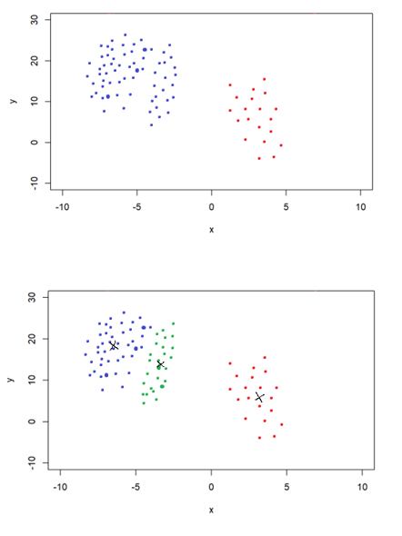
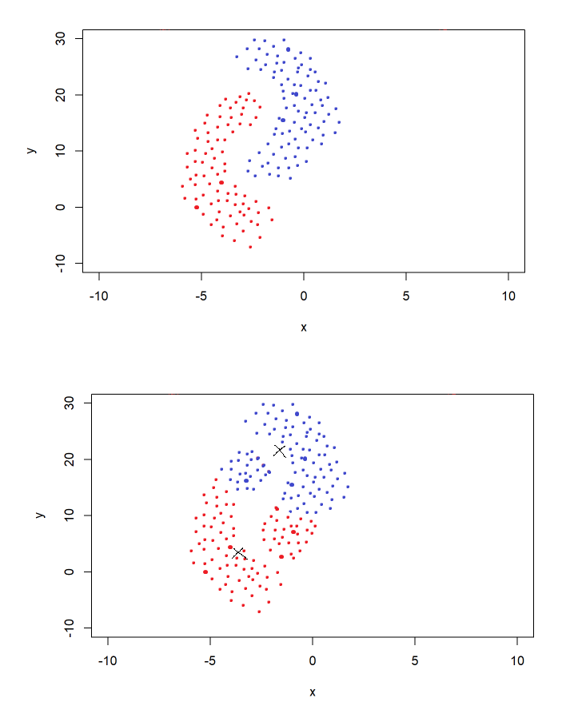
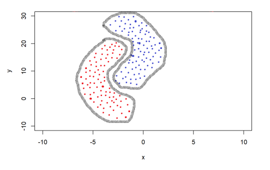

### Question 1

Do Question 7.11 from the textbook. **Note:** If you like, you need only do the last part. You can view parts a-f as merely suggestions on *how* to do the last part.

(a) Generate a response $Y$ and two predictors $X_1$ and $X_2$, with $n = 100$.

```{r}

set.seed(15)

y <- rnorm(100)
x1 <- rnorm(100)
x2 <- rnorm(100)

```

(b) Initialize $\hat{β_1}$ to take on a value of your choice. It does not matter what value you choose.

```{r}

b1 <- -6

```


(c) Keeping $\hat{β_1}$ fixed, fit the model $Y − \hat{β_1}X_1 = β_0 + β_2X_2 + \epsilon$.


```{r}

a = y - b1*x1
b2 = lm(a~x2)$coef[2]

```


(d) Keeping $\hat{β_2}$ fixed, fit the model $Y − \hat{\beta_2}X_2 = β_0 + β_1X_1 + \epsilon$

```{r}

a = y - b2*x2
b1 = lm(a~x1)$coef[2]

```


(e) Write a for loop to repeat (c) and (d) 1,000 times. Report the estimates of $\hat{β_0}$, $\hat{β_1}$, and $\hat{β_2}$ at each iteration of the for loop. Create a plot in which each of these values is displayed, with $\hat{β_0}$, $\hat{β_1}$, and $\hat{β_2}$ each shown in a different color.

```{r}

df <- data.frame(0, 0, 0)
names(df) <- c('b0', 'b1', 'b2')
for (i in 1:20) {
  b1 <- df[nrow(df), 2]
  a <- y - b1 * x1
  b2 <- lm(a ~ x2)$coef[2]
  a <- y - b2 * x2
  b1 <- lm(a ~ x1)$coef[2]
  b0 <- lm(a ~ x1)$coef[1]
  df[nrow(df) + 1,] <-list(b0, b1, b2)
  #print(b0)
  #print(b1)
  #print(b2)
}

plot(df$b0, col = "blue", type = 'l')
lines(df$b1, col = "green")
lines(df$b2, col = "purple")

```


(f) Compare your answer in (e) to the results of simply performing multiple linear regression to predict $Y$ using $X_1$ and $X_2$. Use the abline() function to overlay those multiple linear regression coefficient estimates on the plot obtained in (e).

```{r}

plot(df$b0, col = "blue", type = "l")
lines(df$b1, col = "green")
lines(df$b2, col = "purple")
lm_fit <- coef(lm(y~x1+x2))
abline(h = lm_fit[1], lty = 2)
abline(h = lm_fit[2], lty = 2)
abline(h = lm_fit[3], lty = 2)

```


(g) On this data set, how many backfitting iterations were required in order to obtain a “good” approximation to the multiple regression coefficient estimates?

After two iterations, the approximations were fairly close to their final values (close to the dashed line). They converged after four iterations and don't change for higher iterations. 


### Question 2

This question is about fitting the SVM classifier described in Equations (9.12-9.15) of the textbook, using 2-fold cross-validation. Sketch a large dataset in $\mathbb{R}^{2}$, along with a generic-looking split into testing and training parts, that satisfy the following:

  - Any classifier that is *linear* in the two-dimensional observations will have very large training and testing error (e.g. more than 15 percent misclassified).
  
  - You can add a (small number of) *nonlinear* feature(s) so that the associated SVM classifier that has 0 training error. 
  
  - When you use the nonlinear features described in the previous part of the question and do cross-validation, the tuning parameter $C$ that is chosen will be $>10$ *and furthermore* the training error will be $>0$, despite the fact that a 0-error split is possible.
  
  
Give a short informal explanation of why this dataset will have all these properties, and write down the function used in the nonlinear classifier. 


```{r}

library(class)

set.seed(3)

n = 3000
x = runif(n,-10,24)
y = 0.3*x^2 + rnorm(n, -2, 2)
x2 = runif(n,-5, 10)
y2 = 0.3*x2^2 + rnorm(n, 8, 2)

windows.options(width=10, height=10)
plot(x, y, type="p",col="blue", cex = 0.75, xlim=c(-3,6), ylim=c(-2,8))
points(x2, y2, col = "red", cex = 0.75)

```

Note: This is not *perfect* but the best I could manage with a simulation plot.

The data sketched above is not linearly separable but could be fit using a polynomial classifier of degree 2. In repeated samples, some training data may be able to fit perfectly such that all $\sum\varepsilon_i = 0 = C$, i.e. all points are outside of the margin, and no points are misclassified. However, new data will vary along this line so there will be some amount of test error due to overfitting to the train set. Since we prefer to minimize test error rather than training error, the optimal model chosen through 2-fold cross validation will have a value $C > 0$ allowing some values to fall within the margin (or to be misclassified) in order to generalize better to test data, though it would no longer fit perfectly to the training data and therefore training error will be $>0$. This is another example of the bias-variance tradeoff, where some amount of bias is accepted for improved variance.

The equation (kernel method for polynomial, $p = 2, d = 2$):

$$f(x) = \beta_0 + \sum_{i\in S}a_i(1+\sum_{j=1}^{2}x_jx_{ij})^2$$

Where $S$ is the set of support vector indices (boundary points that influence the position of the classifier). Since $C >10$, there will be atleast 11 support points.


### Question 3

In class, we considered fitting the Gaussian mixture model (GMM) $Y_{i} \sim \mathrm{Unif}(\{0,1\})$, $X_{i} | Y_{i} \sim N(\mu_{Y_{i}}, \sigma_{Y_{i}}^{2})$ (**Note:** yes, the $X_{i}$'s are one-dimensional). We saw that, when $\sigma_{0},\sigma_{1}$ are assumed known, we could estimate $Y_{1},\ldots,Y_{n}$ and $\mu_{0},\mu_{1}$ using an algorithm that was nearly identical to the k-means algorithm. 

  + Like the k-means algorithm, the algorithm for fitting the GMM does not always converge to the global optimum - it can get "stuck" at a local optimum. Sketch a dataset and an estimate that is stuck at a local optimum.
  
  
  The first plot below shows the true clustering, and the second plot shows a hypothetical GMM outcome that is stuck at a local optimum (crosses indicate lowest estimate). 
  
  
  
  
  + Sketch a dataset for which there are two obvious clusters, but where $2$-means will not give the right answer. Sketch the solution given by 2-means, describe an algorithm that *will* give something quite close to the right answer, and sketch this algorithm's decision boundary. **Note:** depending on the particular algorithm chosen, it might be easier to make this last sketch in several pieces. That is fine.
  
  
  As above, the first graph is the true assignment and the bottom graph is the result of 2-means clustering. A draw back of k-means clustering is it cannot detect clustering shapes that are not globular.





 However, density clustering can detect irregular shapes by focusing on maximizing distances between boundaries (it would do much better at detecting the cluster pattern above).





### Question 4

Do problem 10.4 from the textbook.

Suppose that for a particular data set, we perform hierarchical clustering using single linkage and using complete linkage. We obtain two dendrograms.

(a) At a certain point on the single linkage dendrogram, the clusters ${1, 2, 3}$ and ${4, 5}$ fuse. On the complete linkage dendrogram, the clusters ${1, 2, 3}$ and ${4, 5}$ also fuse at a certain point. Which fusion will occur higher on the tree, or will they fuse at the same height, or is there not enough information to tell?

There is not enough information. If all of the distances are the equal, then they could occur at the same height on the dendrograms. 

(b) At a certain point on the single linkage dendrogram, the clusters ${5}$ and ${6}$ fuse. On the complete linkage dendrogram, the clusters ${5}$ and ${6}$ also fuse at a certain point. Which fusion will occur higher on the tree, or will they fuse at the same height, or is there not enough information to tell?

Given that there are only two points to compare, the single distance will be both the minimum and the maximum, so single linkage and complete linkage will fuse at the same height. 

### Question 5

You generate $n=100000$ data points $(x_{i},y_{i})$ as follows: $x_{i} = \frac{i}{n}$, $y_{i} = N(0,1)$ (so that $y_{i}$ is actually independent of $x_{i}$). You are considering the following modelling strategy: you will fit the data to the $k$-nearest-neighbour model for various values of $k \in \{1,2,\ldots,n-1\}$, and will to choose the correct value of $k$ via cross-validation. In this questionm we'll look at what happens in this ``uninformative" regime.

  - Computed the expected mean-squared *training* error for these models, for all values of $k$. **Note:** yes, this means that there will be a nice formula.
  - Compute the expected mean-squared leave-one-out cross-validation (LOOCV) error of these models, for all values of $k$.
  - The *variance* of the mean-squared LOOCV error is on the order of $\frac{1}{n}$, so that the standard deviation is on the order of $\frac{1}{\sqrt{n}}$. Based on this information and the answers to the previous questions, which value of $k$ *would you like* to be chosen by this procedure? Which values of $k$ are *plausible* results of this procedure? **Note:** The data is not deterministic, so you may not get your desired result!
  
  LOOCV uses $K = n-1$, fitting each point on the mean of the other points. When $n$ is very large, the mean of all of these values should be very close to zero. Since all $y_i$ have mean zero, the sample mean as $n$ gets large converges to the population mean. 
